<script src="main.js"></script>
  <script type="text/javascript" id="MathJax-script" async
    src="https://cdn.jsdelivr.net/npm/mathjax@3/es5/tex-mml-chtml.js">
    </script>
  <script>
    MathJax = {
      loader: { load: ['[tex]/physics','[tex]/newcommand'] },
      tex: {
        inlineMath: [['$', '$'], ['\\(', '\\)']],
        packages: { '[+]': ['physics', 'newcommand'] },
      },
      chtml: {
        matchFontHeight: false
      }
    };
  </script>
<style>
	img{
		max-height:50vh;
		max-width:100vw
	}
	video{
		max-width:100vw;
	}
</style>

# はじめに

 $\LaTeX$ を始める前、 $\LaTeX$ を使って数式を打っているということを聞いて自分も $\LaTeX$ を打ってみたいと思ったがそもそも $\LaTeX$ とは何かということもわからず何がどうなってあの数式てんこ盛りのPDFができるんだかわからなかったのでとりあえず $\LaTeX$ を使えるようにする方法を書く。

#  $\LaTeX$ とは

 $\LaTeX$ とは数式を含む文書を制作してPDFにするシステムあるいはプログラミング言語である。（もともとPDFは関係ないらしいが）基本的にはこんな画面で打つ。
 
 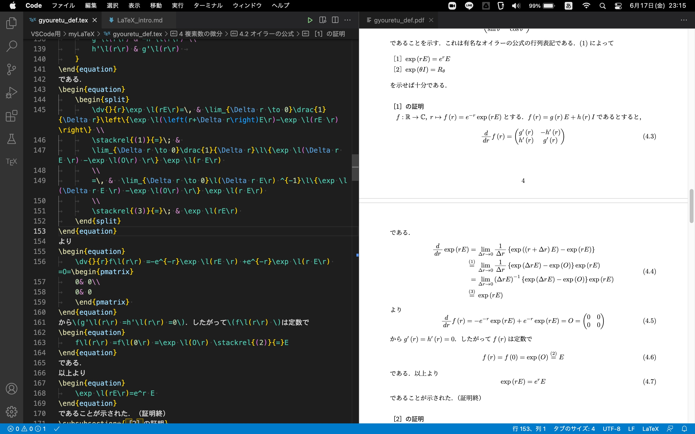


大体左側に.texのファイル、右側にpdfをおくのが主流。とはいえ普通のパソコンには当然こんなことができるアプリはデフォルトで入っていないので自分で入れるかブラウザ上で実行するかの方法で利用することになる。


# ブラウザで使う方法

ブラウザから打つ方が環境構築で時間を取られない分コードに集中できるので初心者にとっては圧倒的に楽である。ブラウザで数式を含む文書を打ってPDFにするのに使うツールは大体OverleafかCloud LaTeXの二択だと思う。

## Cloud LaTeX

[Cloud LaTeX](https://cloudlatex.io)にアクセスする。

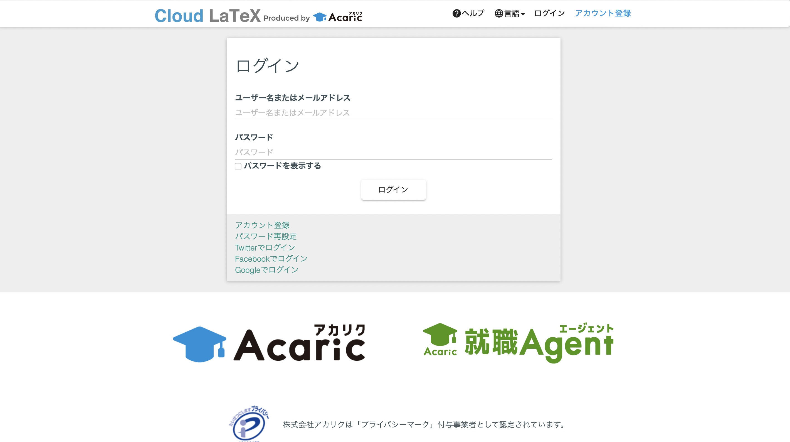

メールアドレスを入力して一通り終わるとこうなる。


＋新規プロジェクトというところを開くと始められる。
日本のものなので当然日本語入力もデフォルトで入っている。たとえ $\LaTeX$ のコマンドを一切知らなくても例えばテンプレートを開いて中のテキストを打ち直す、あるいは数式をいじって数値を変えてみるといったことをしてコンパイルすれば即座に自分で数式を打ち込む快感を味わうことができるのである。

一番簡単なテンプレート

```latex
\documentclass{jsarticle}
\begin{document}
ああいい天気だ。カタカナも打てる。数式も\(a+b=c+1\)のように打てる。
\end{document}
```
空のプロジェクトを作って打つとこうなる。

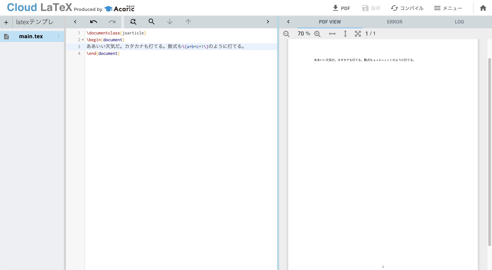

Cloud LaTeXを使う上でターゲット設定に注意しておく必要がある。


<video controls controles poster="" >
<source src="LaTeX_intro_sfiles/SS_2022-06-17_23-41-32.mov">
</source>
</video>

この場合は自分で作ったabc.tex（名前に意味はない）をコンパイルしてpdfにしようと思ってもできないことがあるが、それはターゲット設定をしていないからである。一回右クリックしてターゲット設定すればコンパイルできる。なお新しくファイルを作るには新しくプロジェクトを追加するか左上の＋から「ファイルの追加」で追加すれば良い。その際 $\LaTeX$ としてコンパイルしたいファイルの末尾には必ず拡張子.texをつけることに注意する。PDFをダウンロードしたければ右上のPDFボタンをクリックすれば良い。Cloud LaTeXは結構サジェスト機能が充実していてpandocやplatex以外のコンパイラを使用することもできるので便利。

## Overleaf

[Overleaf](https://www.overleaf.com)はJohn Hammersleyと John Lees-Millerによって作られた $\LaTeX$ エディタである。英語表記が標準なので、デフォルトで日本語は入っていない。よって使うには多少の設定をする必要がある。詳しくはググれば結構のってる。こちらはどちらかというと玄人向けであるが、入力中の気分の良さは上である、という人もいるかもしれない。

# ローカルで使う方法

ローカルで（インターネットに繋ぐことなく） $\LaTeX$ をコンパイルしてpdfを作るにはそれを実行するファイルをダウンロードしてインストールして使う必要がある。そのためにTeXLive、すなわち命令とインストローラが入ったものを使う。

以下、筆者がMacユーザーのためMacに限って説明する。Windowsの人は他の記事を見てください。あとMacユーザーだがMacTeXは使わない。Macのどこに入れられるのか把握できないものが入っているからである。MacTeX使う人は次の章まで飛ばしてください。（公式のインストローラーをポチればインストールされます。）

## TeX Liveのインストール

まずは[TeX Live公式サイト](https://www.tug.org/texlive/)をブラウザで開く。

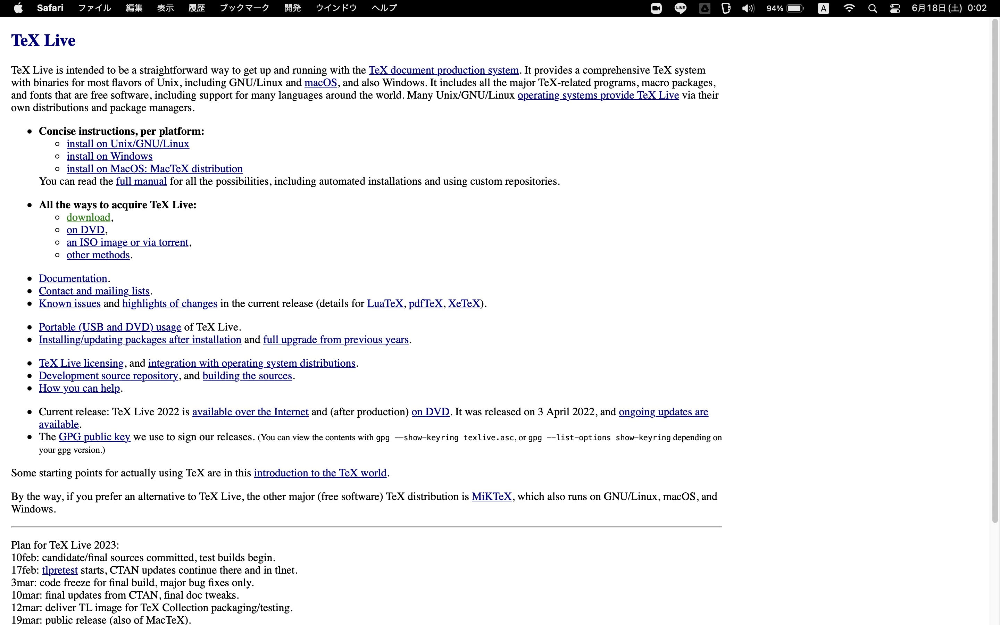


- All the ways to acquire TeX Live:
	- download

のところからダウンロードをクリックしてその先の「install-tl-unx.tar.gz」をクリックすると`install-tl-(日付)`と`install-tl-unx.tar`のファイルがダウンロードフォルダにできる。

以下ターミナルを使う。`ターミナル.app`はLaunchpadあたりで検索すれば出てくるmacのデフォルトアプリである。ターミナルを開く。（自分は背景を黒に設定したのでちょっと違うかも知れない）

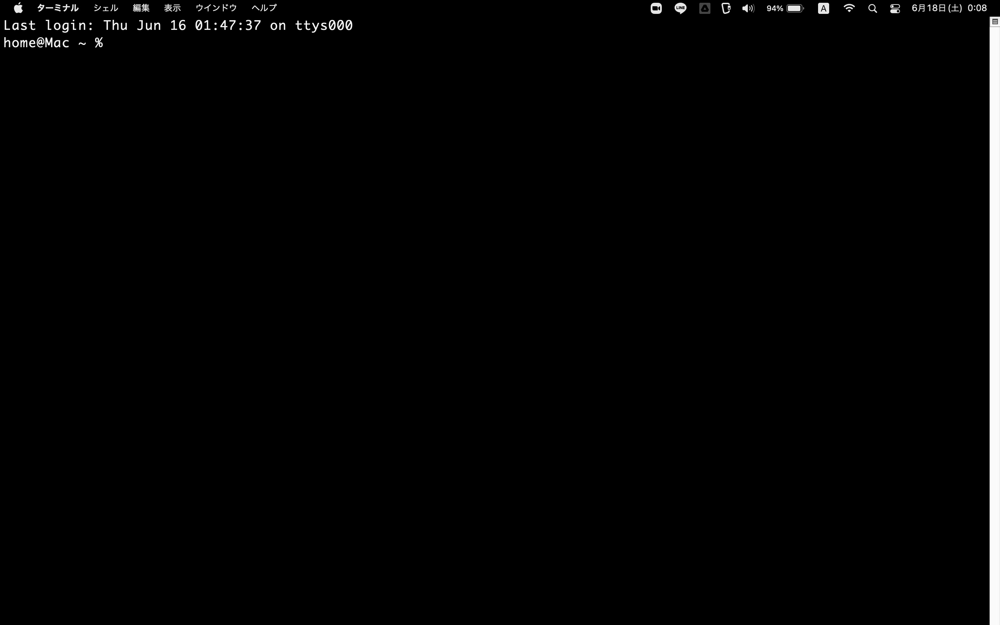

ターミナルで以下のコマンドを実行する。
なお`home`は適宜自分のホームフォルダ名に変えて実行すること。
```
tar xvf "/Users/home/Downloads/install-tl-unx-2.tar"
```
によってダウンロードしたtexliveが展開される。`tar xvf`は展開するコマンド
```
sudo /Users/home/Downloads/install-tl-(日付)/install-tl -no-gui -repository
```
を実行すると4000個くらいのコンテンツが読み込まれ無事インストールされる。`sudo`は管理者権限で実行するコマンド。
ターミナルから
```
platex (コンパイルしたいtexファイルの絶対パス)
```
と入力すればコンパイルできる。

さてターミナルからでも $\LaTeX$ を実行できることはわかったが実際には普通に左右画面表示でtexとpdfを見比べて打てないと参考にならない。それができるもの、すなわちエディタの一つとしてVSCodeを取り上げる。VSCodeはmicrosoft社の無料エディタである。自分で設定できる予測変換機能であるスニペットが使える（一にも二にもスニペット）ので重宝する。

## VSCode環境構築の方法

macOSにかぎって説明する。
VSCodeを入れる。[公式サイト](https://code.visualstudio.com)にアクセスする。

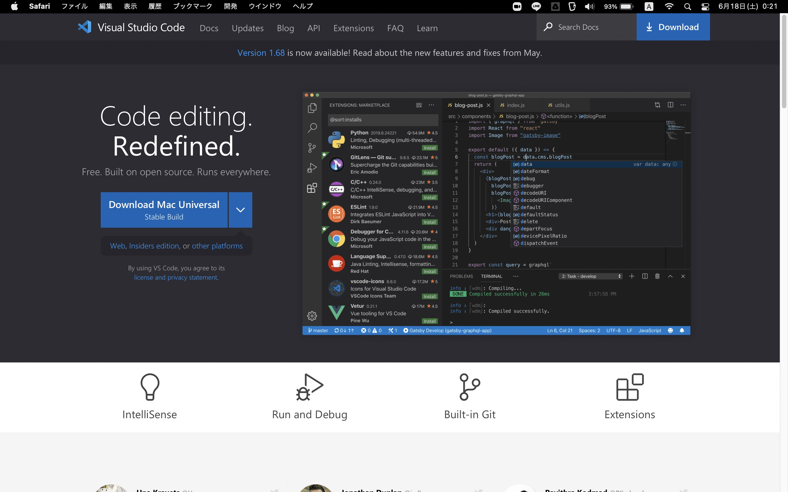

Download Mac Universalからstable build（insidersは試作品みたいな意味っぽい）を選択してクリックする。なおVSCodeは無料なので無料期間が終わったらアップグレードということはないので安心して使える。

ダウンロードしたら必ずアプリケーションフォルダに移動する。これをしないと常に/Users/home/Downloadsからダウンロードする（自分はホームフォルダの名前をhomeにしている）から起動するというややこしいことになる。移動する際、/Applicationsの方に入れる。/System/Applicationでないことに注意。わからなければなんか後から入れたアプリがたくさん入っている方に入れれば良いと考えれば問題ない。

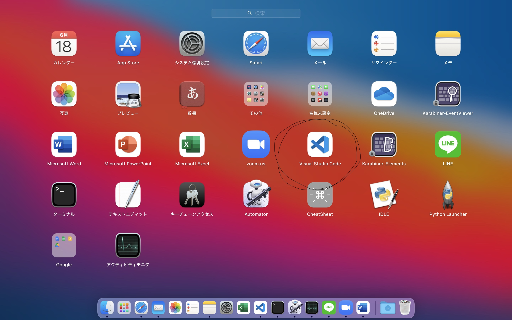

移動したらLaunchPadからVisual Studio Codeを開く。

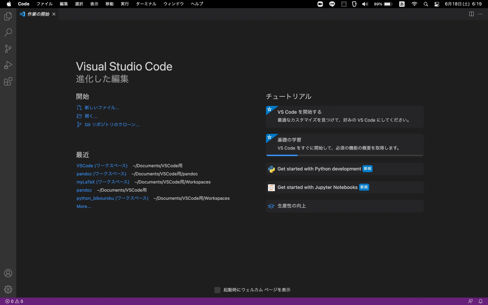

大体こんな画面が表示されるので（多分実際は英語だと思うので慌てなくて良い）まずは左の四角が四つあるところ（拡張機能、Extension）からとりあえずJapanese Language Pack for Visual Studio CodeとLaTeX Workshopをインストールする。

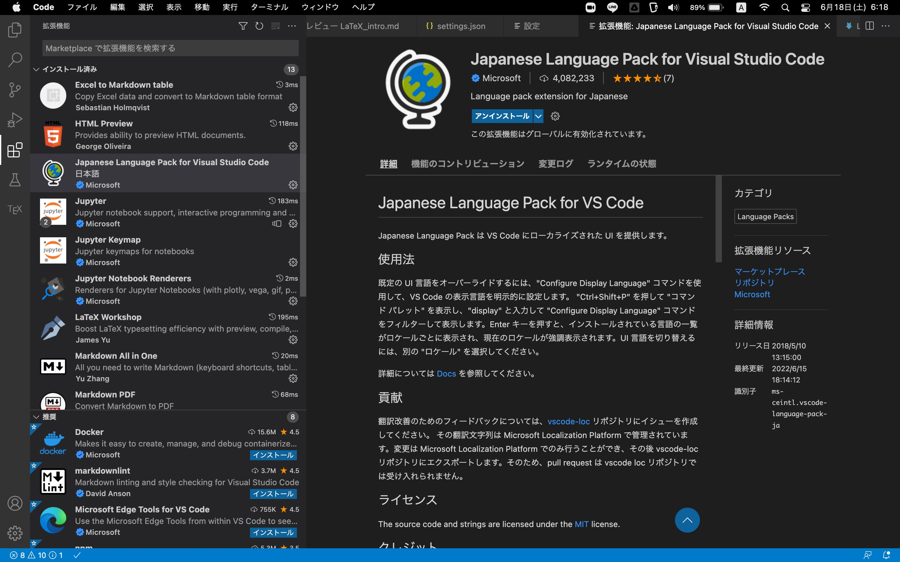

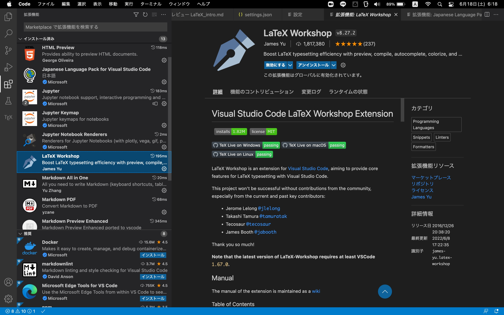

なおどちらもずっと無料なのであしからず。あと下の方が青色になっているが実際はまだフォルダが入っていない状態なので紫色になる。入れたら設定を開いて`setting.json`を開く。

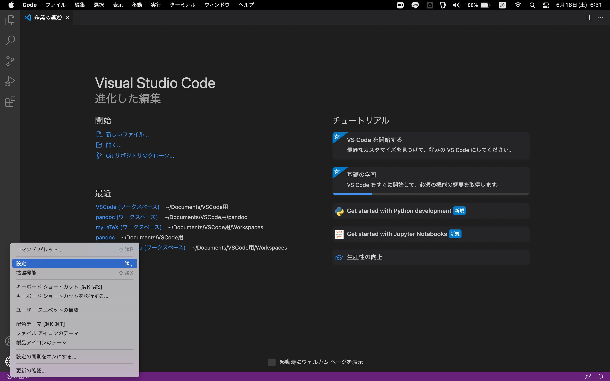

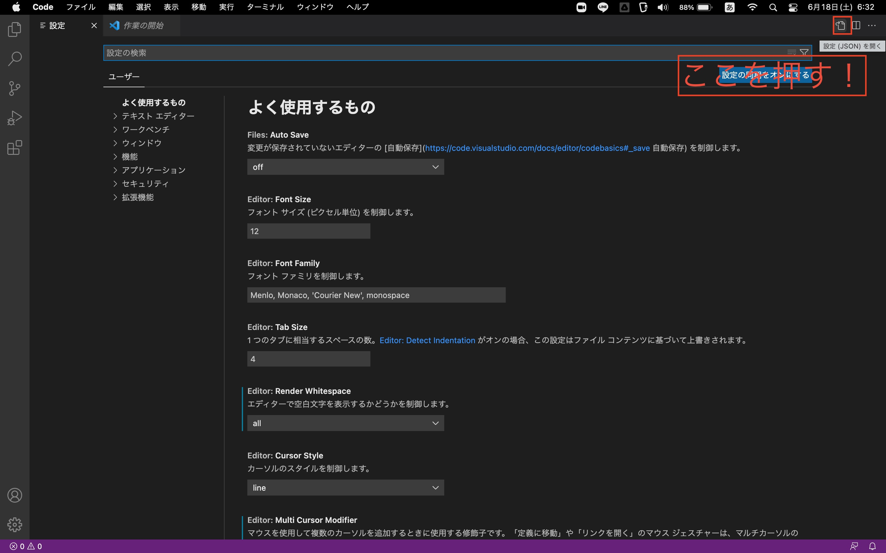

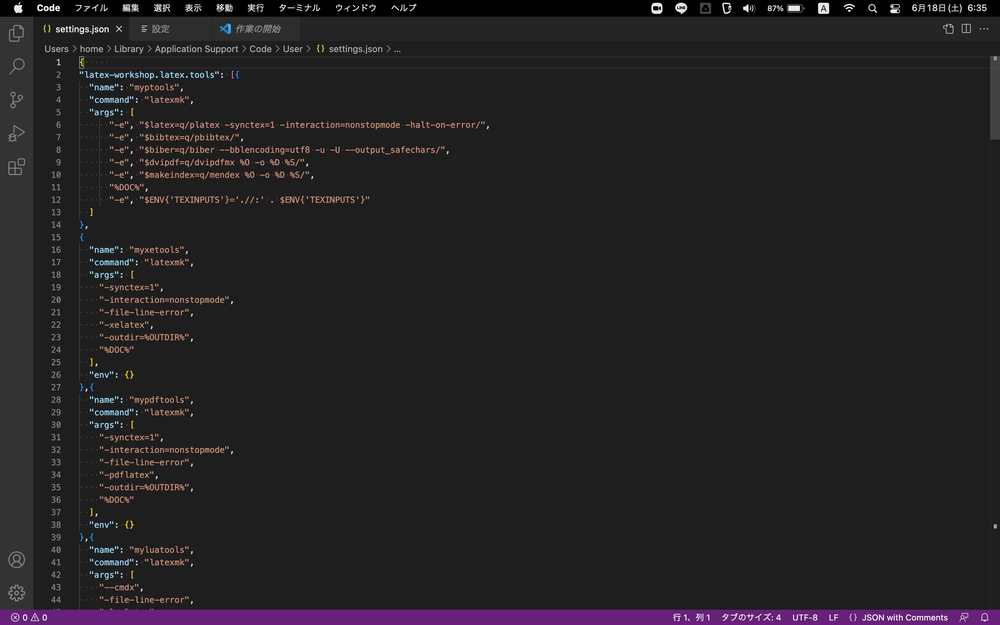

`setting.json`は空になっているこのままでは $\LaTeX$ はコンパイルできない。次の内容に書き換える。

```json
{     
"latex-workshop.latex.tools": {
  "name": "myptools",
  "command": "latexmk",
  "args": [
      "-e", "$latex=q/platex -synctex=1 -interaction=nonstopmode -halt-on-error/",
      "-e", "$bibtex=q/pbibtex/",
      "-e", "$biber=q/biber --bblencoding=utf8 -u -U --output_safechars/",
      "-e", "$dvipdf=q/dvipdfmx %O -o %D %S/",
      "-e", "$makeindex=q/mendex %O -o %D %S/",
      "%DOC%",
      "-e", "$ENV{'TEXINPUTS'}='.//:' . $ENV{'TEXINPUTS'}"
  ]
},
"latex-workshop.latex.recipes": [
  {
    "name": "my_platex_recipes",
    "tools": [
      "myptools"
    ]
  },]
}
```
`myptools`を自分で定義してそのツールをレシピとして動かす。`command`は（多分）ターミナルコマンドのことだと思う。`platex`を使ってもいいのだがこのままだと一回しかコンパイルされず目次を出力できないので勝手に何回もコンパイルしてくれるコマンドlatexmkを使う。`bibtex`というのを見て「なんだこれは」となるが、これは目次をつけるツールであると考えて良い。デフォルトでは`latex`、`bibtex`、`dvipdf`、`makeindex`となっているところをそれぞれ`platex`、`pbibtex`、`dvipdfmx`、`mendex`に書き換える。なんか`p`がつくと日本仕様になるくらいに考えておけば良い。

結構 $\LaTeX$ の`setting.json`の初期設定として下のようなものが書かれているサイトがある（自分は下のような設定をしている）が後から「設定」の中で自分で英語で検索すれば出てくるのでなくてもコンパイルはできる。

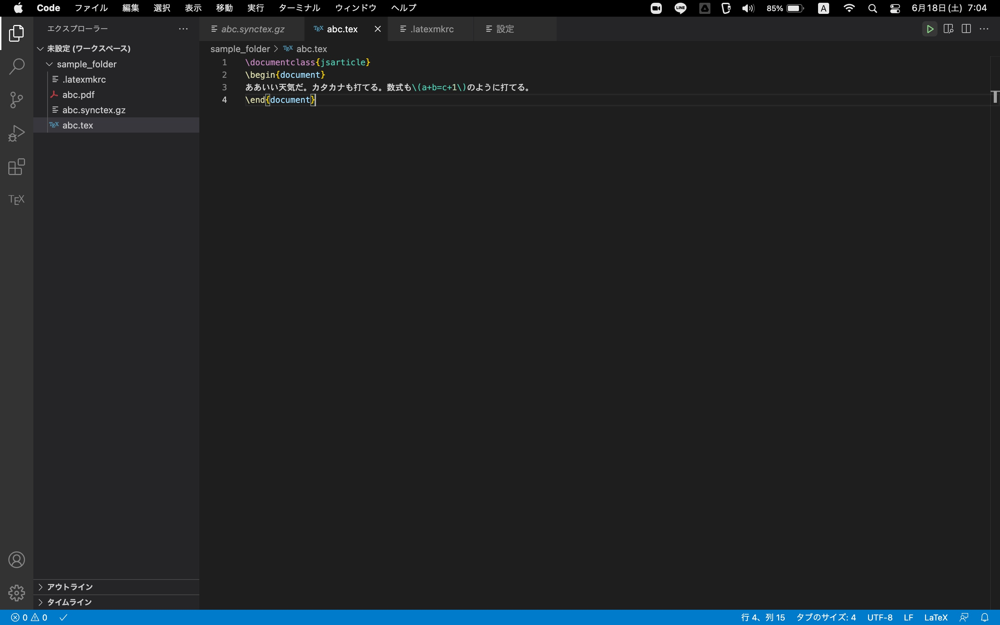

```json
"latex-workshop.view.pdf.viewer": "tab",
"latex-workshop.chktex.enabled": false,
"editor.autoClosingBrackets": "beforeWhitespace",
"editor.bracketPairColorization.enabled": true,
"latex-workshop.latex.autoClean.run": "onBuilt",
"latex-workshop.latex.clean.fileTypes": [
  "*.aux",
  "*.bbl",
  "*.blg",
  "*.idx",
  "*.ind",
  "*.lof",
  "*.lot",
  "*.out",
  "*.toc",
  "*.acn",
  "*.acr",
  "*.alg",
  "*.glg",
  "*.glo",
  "*.gls",
  "*.fls",
  "*.log",
  "*.fdb_latexmk",
  "*.snm",
  "*.synctex(busy)",
  "*.synctex.gz(busy)",
  "*.nav",
  "*.vrb",
  "*.dvi",
  "*.xdv"]
```

おわったら適当なところ（例えば「書類」の中）にフォルダ（名前はなんでも良い、たとえば「sample_folder」）を作る。

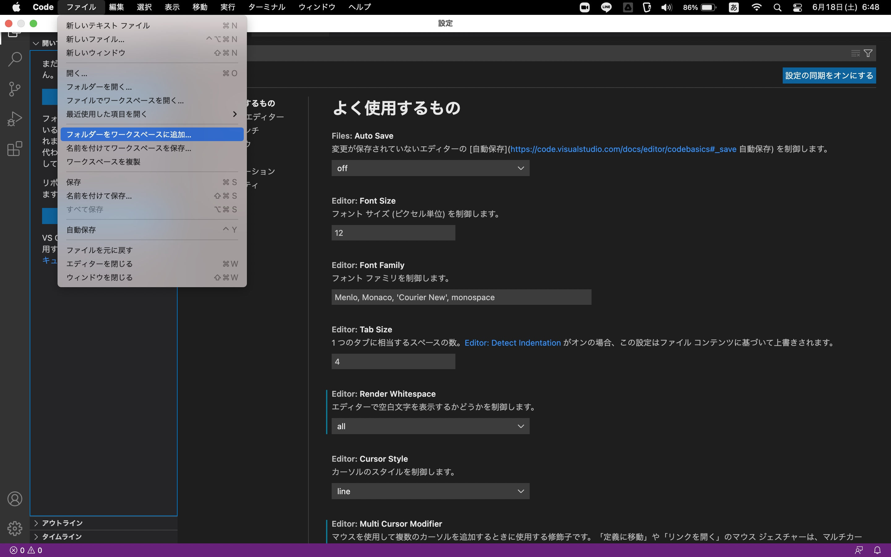


上のように「フォルダをワークスペースに追加．．．」からそれを追加する。

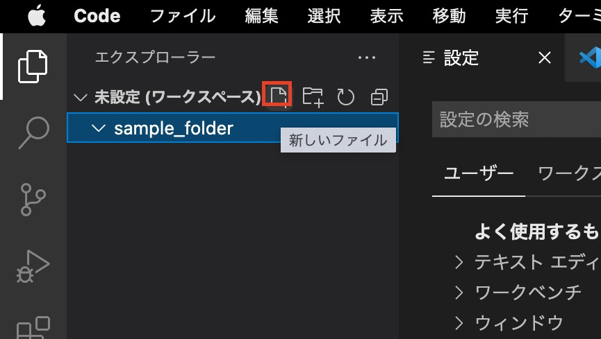

追加したら中に「.latexmkrc」というファイルを作成する。

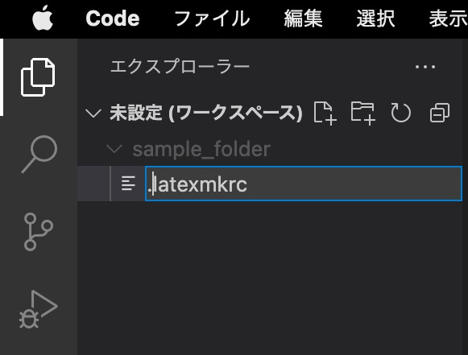

中に以下を記入。
```pl
#!/usr/bin/env perl

# LaTeX
$latex = 'platex -synctex=1 -halt-on-error -file-line-error %O %S';
$max_repeat = 5;

# BibTeX
$bibtex = 'pbibtex %O %S';
$biber = 'biber --bblencoding=utf8 -u -U --output_safechars %O %S';

# index
$makeindex = 'mendex %O -o %D %S';

# DVI / PDF
$dvipdf = 'dvipdfmx %O -o %D %S';
$pdf_mode = 3;

# preview
$pvc_view_file_via_temporary = 0;
if ($^O eq 'linux') {
    $dvi_previewer = "xdg-open %S";
    $pdf_previewer = "xdg-open %S";
} elsif ($^O eq 'darwin') {
    $dvi_previewer = "open %S";
    $pdf_previewer = "open %S";
} else {
    $dvi_previewer = "start %S";
    $pdf_previewer = "start %S";
}

# clean up
$clean_full_ext = "%R.synctex.gz"
#!/usr/bin/env perl
```

入れたら同じフォルダ（今回はsample_folder）の中に例えば「abc.tex」（名前が.texで終わればその前はなんでもいい）というファイルを作る。そこにソースコードを書いて右上の▷を押すとコンパイルできる。虫眼鏡みたいなのを押すとpdfをプレビューできる。あるいは`cmd+shift+P`を押してコマンドパレットから`LaTeX Workshop: Build with recipe`を実行すると`my_platex_recipes`（先ほど`setting.json`で定義したレシピ名）が出てくるのでそこから一度コンパイル（ビルドともいう）すればpdfができる。

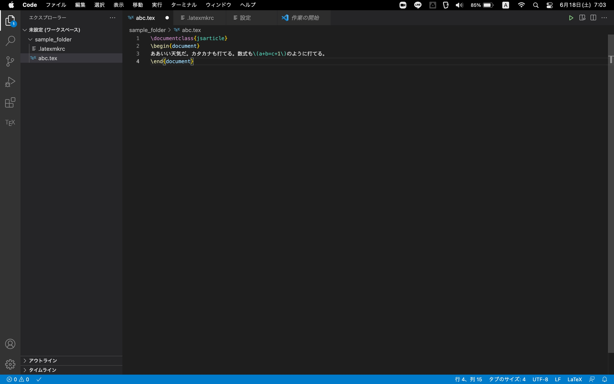

<!--  -->

そんなボタン現れてないからできないよ！ていう人はもしかしたらVSCodeを再起動した方がいいかも（自分はそれで解決した）

<!--  -->

「Visual Studio Codeを終了」を押すと終了するのでアプリをdockかLaunchPadから開くと再起動できる。そうすればボタンが増えてるかも知れない。

「ボタンが増えたけどコンパイルしてもなんだかわからないエラーが表示されてできない！」っていう人はもう一回再起動するか何か別の部分が違ってるのかも知れないからあんまり時間がかかるようであればCloud LaTeX等ブラウザ上で完結させるほうが楽な可能性もある。（スニペットは使えないものの`\newcommand`を駆使すれば結構なんとかなる。）

以上がVSCodeの環境構築。長かった！！！

# まとめ

とりあえず $\LaTeX$ が打ちたい！という人のために環境構築の方法を書いた。参考になれば幸いである。

# 貼ったリンク

[TeX Live公式サイト](https://www.tug.org/texlive/)


[Visual Studio Code公式サイト](https://code.visualstudio.com) 

[Cloud LaTeX](https://cloudlatex.io) 

[Overleaf](https://www.overleaf.com) 


<script src="https://blz-soft.github.io/md_style/release/v1.2/md_style.js" ></script>
